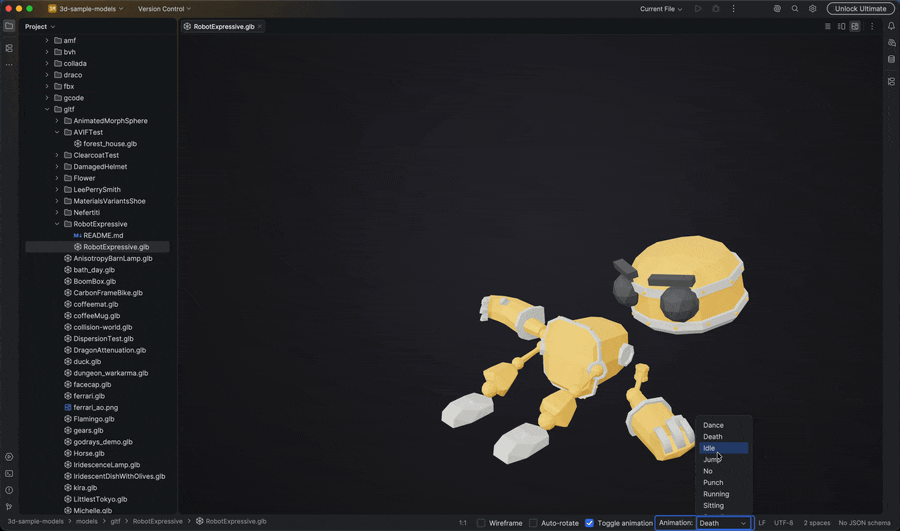
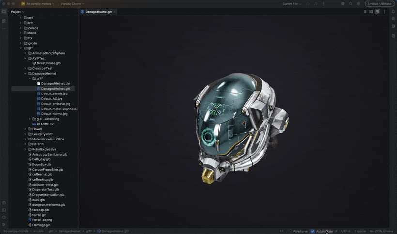
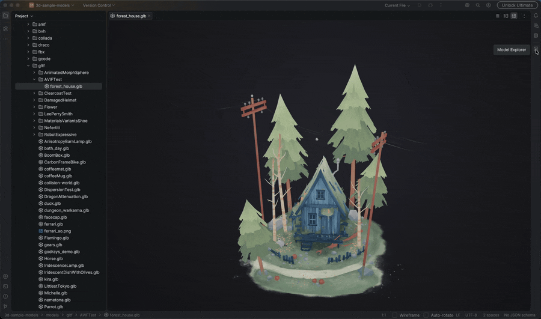
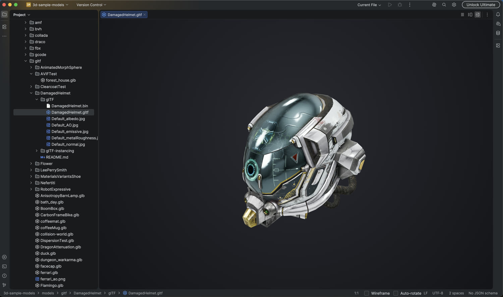
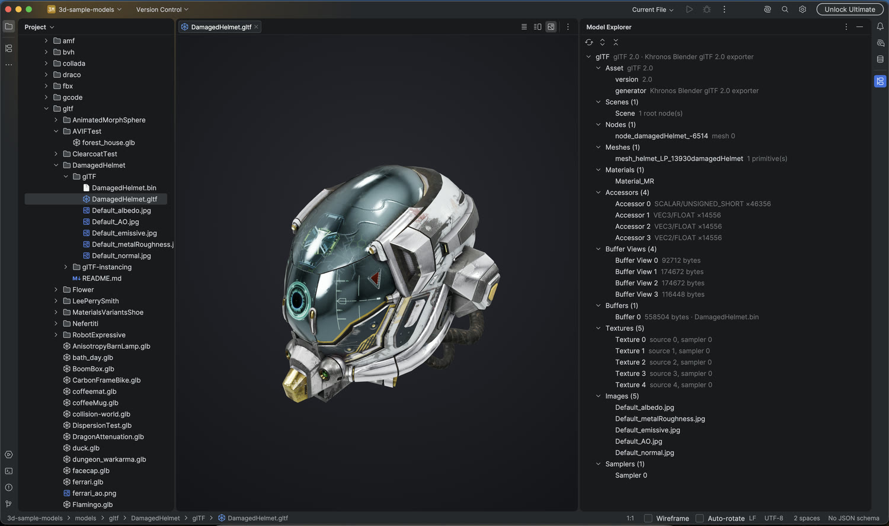
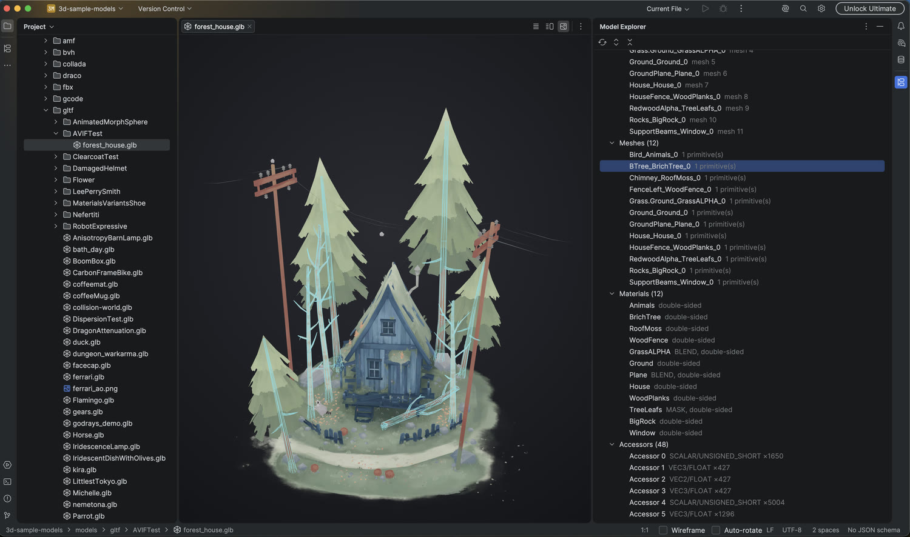
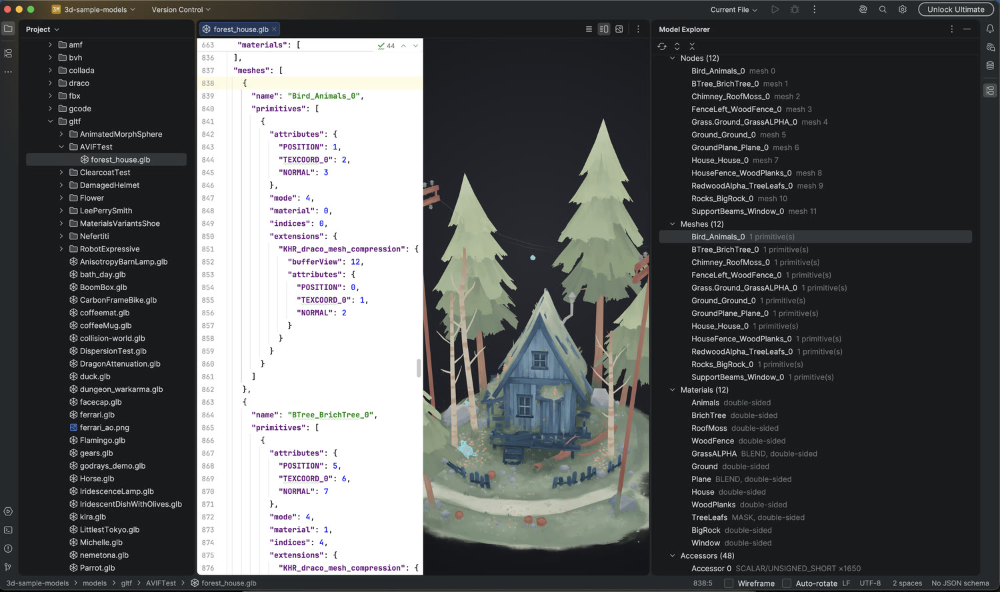
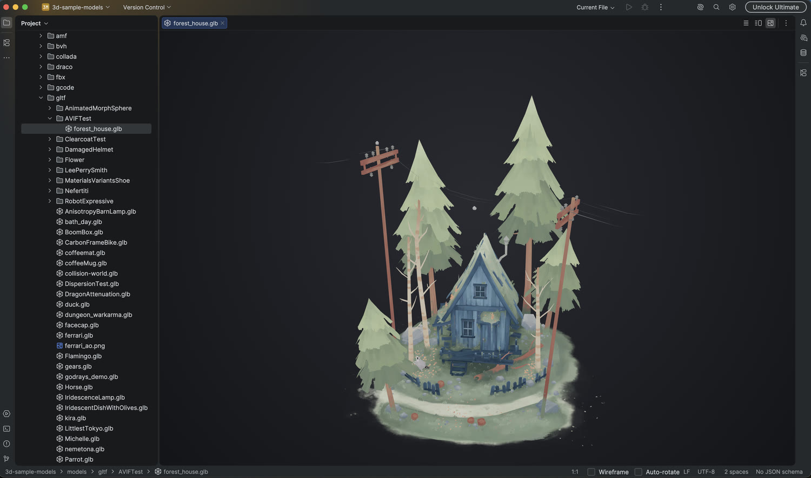
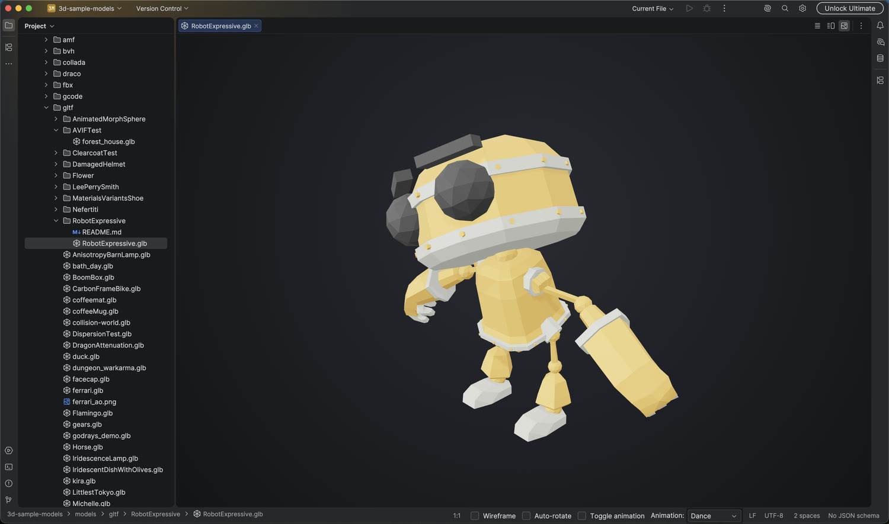

# 3D Model Viewer

View 3D models (GLB, glTF, STL, OBJ, three.js JSON) within your IntelliJ-based IDE.

[](https://plugins.jetbrains.com/plugin/29933)
[](https://plugins.jetbrains.com/plugin/29933)
[](https://plugins.jetbrains.com/plugin/29933/reviews)

Orbit the camera, toggle wireframe, play animations, and inspect the model's internal structure.

## Demo

Click any preview to play the full-quality video.

| Animation playback | Wireframe mode |
| --- | --- |
| [](docs/media/animation.mp4) | [](docs/media/wireframe.mp4) |

[](docs/media/explorer.mp4)

## Screenshots

| | |
| --- | --- |
|  |  |
|  |  |
|  |  |

## Features

- Render 3D models directly in the editor tab
- Orbit, pan, and zoom the camera, with an **Auto-rotate** toggle
- **Wireframe** mode toggle from the status bar
- Animation playback controls (play and pause) from the status bar
- Animation selector for models that contain multiple animations
- View the glTF JSON alongside the 3D preview, with an editor / split / preview toggle
- Highlight materials in the model by moving the caret or selecting inside the glTF JSON (works for `materials`, `meshes`, and `nodes` entries)
- **Model Explorer** tool window that browses a glTF model's internal structure (asset, scenes, nodes, meshes, materials, accessors, buffer views, images, samplers, and animations). Double-click a node to jump to it in the glTF JSON, or select a material, mesh, or node to highlight it in the 3D preview

## Supported File Formats

| Format | Support |
| --- | --- |
| **GLB** | Built in, works out of the box |
| **glTF** | Built in, referenced assets (textures, binary buffers) are bundled automatically |
| **STL** | Built in, geometry only (binary and ASCII) |
| **three.js JSON** | Built in for three.js model JSON (BufferGeometry, Object, or Scene), with a toggle between the JSON editor and the 3D preview |
| **OBJ** | Optional, enable it in **Settings > Tools > 3D Model Viewer** |

## Installation

### From JetBrains Marketplace

1. Open **Settings** > **Plugins** > **Marketplace**
2. Search for "3D Model Viewer"
3. Click **Install**
4. Restart the IDE if prompted

### From GitHub Releases

1. Download the latest `.zip` from [GitHub Releases](https://github.com/iz-ben/3d-model-viewer/releases)
2. Open **Settings** > **Plugins**
3. Click the gear icon and choose **Install Plugin from Disk...**
4. Select the downloaded zip file
5. Restart the IDE if prompted

## Usage

1. Open any supported model file (`.glb`, `.gltf`, `.stl`, three.js JSON, or `.obj` when enabled)
2. The model renders in the editor tab
3. Use the status bar widgets to toggle **Wireframe**, toggle **Auto-rotate**, **play or pause** animations, and select an animation
4. For glTF files, open the **Model Explorer** tool window (right stripe, shown while a glTF file is focused) to browse the model's internal structure. Double-click a node to jump to it in the glTF JSON, or select a material, mesh, or node to highlight it in the preview

## Compatibility

Works across JetBrains IDEs and Android Studio.

## Contributing

This project uses [Conventional Commits](https://www.conventionalcommits.org/) to determine version bumps and generate the changelog automatically.

### Commit Message Format

```
<type>[optional scope]: <description>

[optional body]

[optional footer(s)]
```

### Commit Types

| Type | Description | Version Bump |
| --- | --- | --- |
| `feat:` | A new feature | Minor |
| `fix:` | A bug fix | Patch |
| `docs:` | Documentation only changes | None |
| `style:` | Code style changes (formatting, and similar) | None |
| `refactor:` | Code refactoring | None |
| `perf:` | Performance improvements | None |
| `test:` | Adding or updating tests | None |
| `chore:` | Maintenance tasks | None |

### Breaking Changes

Add `BREAKING CHANGE:` in the commit footer, or a `!` after the type, to trigger a **major** version bump:

```
feat!: remove deprecated API endpoints

BREAKING CHANGE: The v1 API has been removed in favor of v2.
```

### Examples

```bash
# Patch release (1.0.0 -> 1.0.1)
git commit -m "fix: resolve memory leak in 3D renderer"

# Minor release (1.0.0 -> 1.1.0)
git commit -m "feat: add support for FBX file format"

# Major release (1.0.0 -> 2.0.0)
git commit -m "feat!: redesign plugin settings UI"
```

## Support

If you find this plugin useful, consider supporting its development:

- Star this repository and [rate it on the JetBrains Marketplace](https://plugins.jetbrains.com/plugin/29933/reviews) to help others discover it
- Buy me a coffee: [buymeacoffee.com/coterieke](https://buymeacoffee.com/coterieke)

## License

Licensed under the MIT License. See the [LICENSE](LICENSE) file for details.

## Links

- [JetBrains Marketplace](https://plugins.jetbrains.com/plugin/29933)
- [GitHub Repository](https://github.com/iz-ben/3d-model-viewer)
- [Report Issues](https://github.com/iz-ben/3d-model-viewer/issues)
