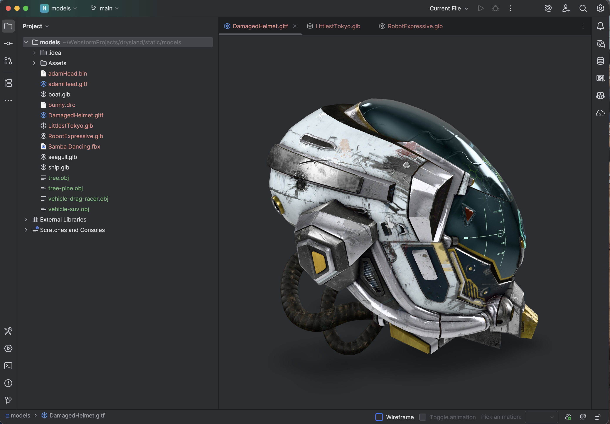
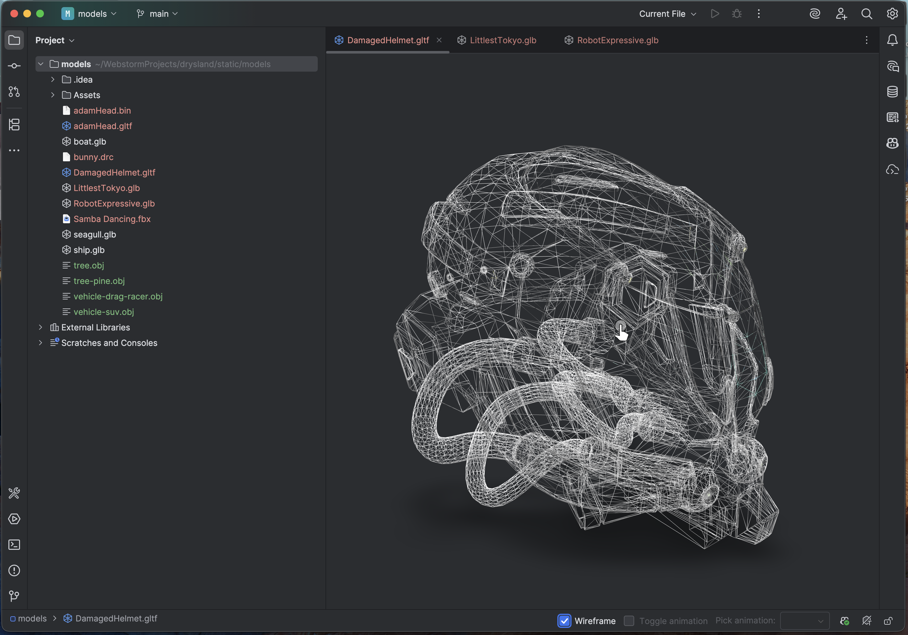
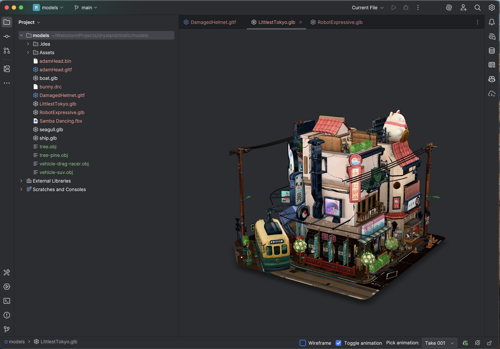
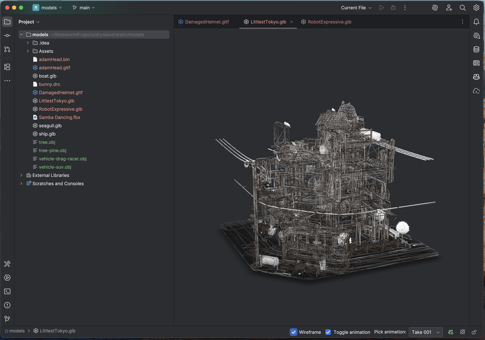
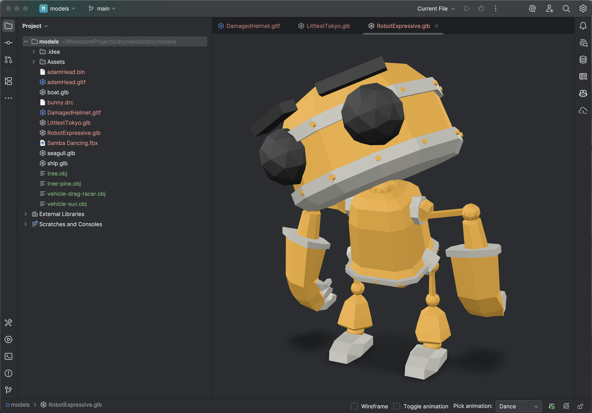
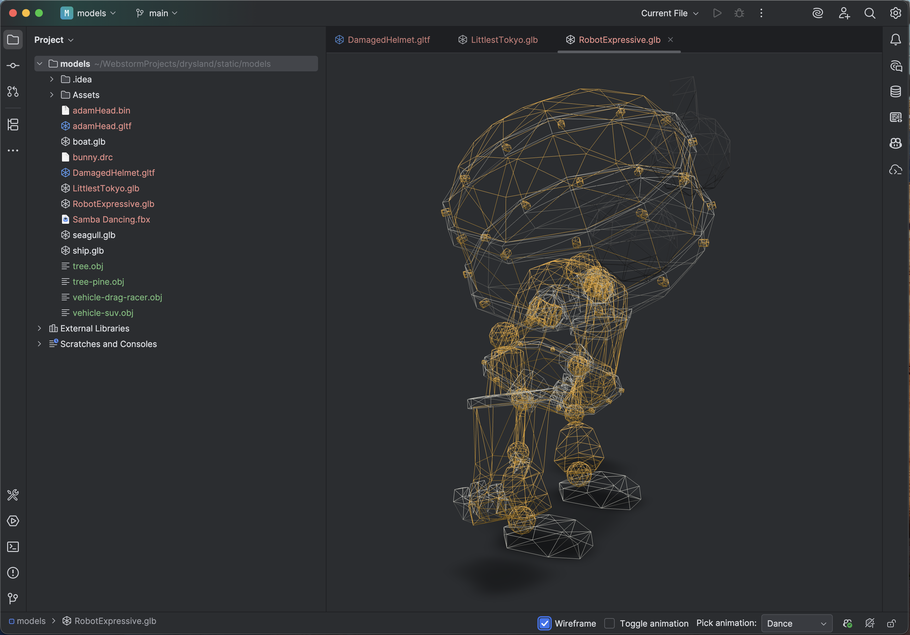

# 3D Model Viewer

View and inspect 3D models directly in your IntelliJ-based IDE.

## Features

- View 3D models directly in the editor
- Wireframe mode toggle via status bar
- Animation playback controls (play/pause)
- Animation selector for models with multiple animations
- glTF JSON view alongside the 3D preview (Markdown-style editor / split / preview toggle)
- Highlight materials in the model by moving the caret or selecting inside the glTF JSON
  (works for `materials`, `meshes`, and `nodes` entries)

## Supported File Formats

- **GLB** — Built-in support, works out of the box
- **GLTF** — Built-in support, automatically bundles referenced assets (textures, binary files)
  > ⚠️ GLTF support has limited handling for non-self-contained files; external textures may fail to show.
- **OBJ** — Optional support, enable in **Settings → Tools → 3D Model Viewer**
  > ⚠️ OBJ support is opt-in because other plugins may also register the `.obj` file extension. Enabling this feature is left to your discretion to avoid potential conflicts. Requires IDE restart after enabling.

## Installation

### From JetBrains Marketplace

1. Open **Settings** → **Plugins** → **Marketplace**
2. Search for "3D-Model-Viewer"
3. Click **Install**
4. Restart IDE if prompted

### From GitHub Releases

1. Download the latest `.zip` file from [GitHub Releases](https://github.com/iz-ben/3d-model-viewer/releases)
2. Open **Settings** → **Plugins**
3. Click the ⚙️ icon → **Install Plugin from Disk...**
4. Select the downloaded zip file
5. Restart IDE if prompted

## Usage

1. Open any supported 3D model file (`.glb`, `.gltf`, or `.obj` if enabled)
2. The model will render in the editor tab
3. Use the status bar widgets at the bottom to:
   - Toggle **Wireframe** mode
   - **Play/Pause** animations
   - Select animations

## Screenshots & Videos

## Demo Videos

[](assets/videos/damaged_helmet.mp4)
[](assets/videos/littlest_tokyo.mp4)
[](assets/videos/robot_expressive.mp4)

## Screenshots
<div class="slider">
  
  
  
  
  
  
</div>

## Contributing

This project uses [Conventional Commits](https://www.conventionalcommits.org/) to automatically determine version bumps and generate changelogs.

### Commit Message Format

```
<type>[optional scope]: <description>

[optional body]

[optional footer(s)]
```

### Commit Types

| Type | Description | Version Bump |
|------|-------------|--------------|
| `feat:` | A new feature | Minor |
| `fix:` | A bug fix | Patch |
| `docs:` | Documentation only changes | None |
| `style:` | Code style changes (formatting, etc.) | None |
| `refactor:` | Code refactoring | None |
| `perf:` | Performance improvements | None |
| `test:` | Adding or updating tests | None |
| `chore:` | Maintenance tasks | None |

### Breaking Changes

Add `BREAKING CHANGE:` in the commit footer or `!` after the type to trigger a **major** version bump:

```
feat!: remove deprecated API endpoints

BREAKING CHANGE: The v1 API has been removed in favor of v2.
```

### Examples

```bash
# Patch release (1.0.0 → 1.0.1)
git commit -m "fix: resolve memory leak in 3D renderer"

# Minor release (1.0.0 → 1.1.0)
git commit -m "feat: add support for FBX file format"

# Major release (1.0.0 → 2.0.0)
git commit -m "feat!: redesign plugin settings UI"
```

## Support

If you find this plugin useful, consider supporting its development:

☕ [Buy Me a Coffee](https://buymeacoffee.com/coterieke)

## License

This project is licensed under the MIT License - see the [LICENSE](LICENSE) file for details.

## Links

- [GitHub Repository](https://github.com/iz-ben/3d-model-viewer)
- [Report Issues](https://github.com/iz-ben/3d-model-viewer/issues)
